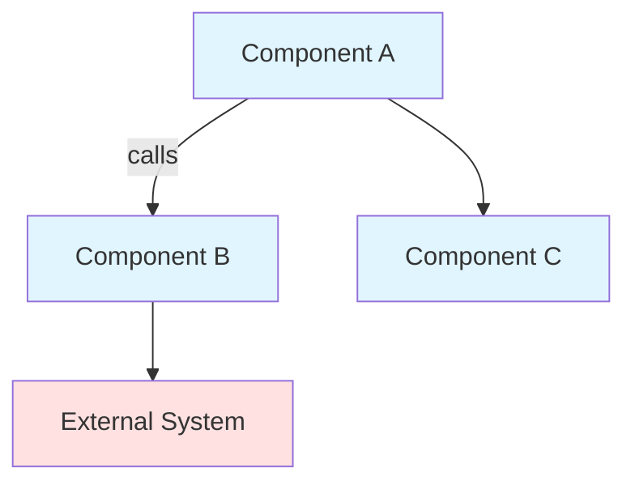
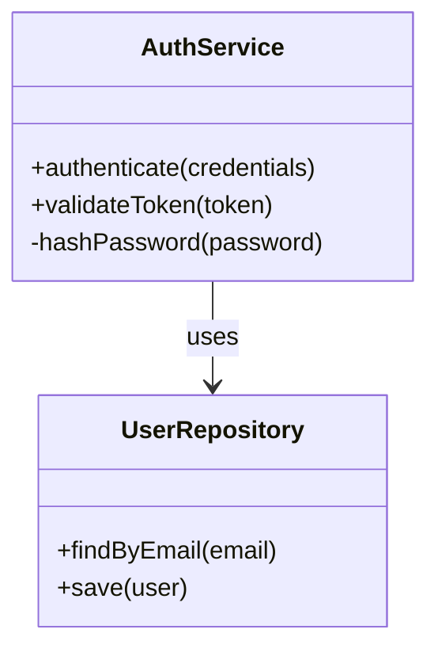
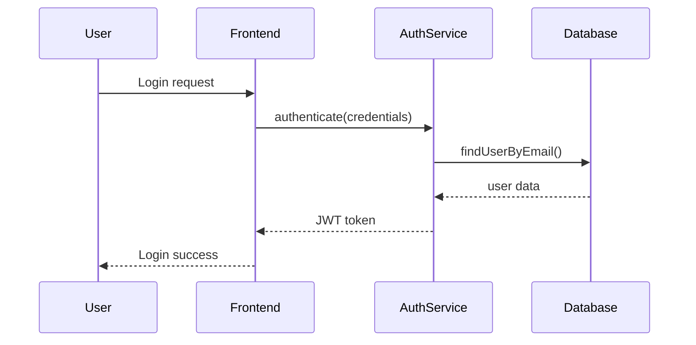

# Software Architecture Brainstorming

## Overview

Collaborative brainstorming skill for software architecture and design decisions. Focuses on applying design patterns (Gang of Four), SOLID principles, TDD, DRY, YAGNI, and other best practices to create well-architected solutions. Produces design documents with architecture diagrams, not code implementations.

**Core Philosophy:**
- Conversational and collaborative approach
- Work toward the simplest solution that meets actual needs
- Apply principles and patterns when they add value, not dogmatically
- Question assumptions and explore alternatives
- Create comprehensive design documents as output

## When to Use This Skill

Invoke this skill when:
- Designing new features or systems from scratch
- Refactoring existing architecture
- Evaluating architectural decisions and trade-offs
- Learning or applying design patterns
- Creating design documentation
- Discussing how to structure code without writing implementation
- Exploring multiple approaches to a problem

Do NOT use this skill when:
- Implementing code (use normal coding workflow)
- Debugging existing code
- Making trivial changes that don't require architectural thinking
- User explicitly wants quick code without design discussion

## Collaborative Brainstorming Process

### 1. Understand the Problem

Begin by understanding what the developer is trying to accomplish through open-ended discovery.

**Ask clarifying questions:**
- What problem are you trying to solve?
- What are you building this for?
- Who will use this?
- What are the core requirements?
- What constraints exist (performance, scale, technology, team)?

**Understand context:**
- What exists today?
- What pain points exist?
- What's the expected timeline?
- What's the risk tolerance?

**Document understanding:**
- Summarize the problem clearly
- Confirm understanding before proceeding
- Identify any assumptions being made

### 2. Explore Requirements

Work with the developer to clarify functional and non-functional requirements.

**Functional requirements:**
- What must the system do?
- What are the user workflows?
- What are the edge cases?
- What's in scope vs. out of scope?

**Non-functional requirements:**
- Performance needs (throughput, latency)
- Scalability expectations
- Reliability/availability targets
- Security and compliance
- Maintainability and testability
- Integration points

**Apply YAGNI rigorously:**
- Focus on actual needs, not "might need someday"
- Challenge speculative requirements
- Defer complexity until it's truly needed
- Ask: "What's the simplest thing that could work?"

### 3. Propose Initial Approach

Present a high-level approach that addresses the requirements simply and clearly.

**Start with simplest solution:**
- What's the most straightforward way to solve this?
- Avoid premature optimization or over-engineering
- Focus on core functionality first

**Identify key components:**
- What are the main responsibilities?
- How do they interact?
- What are the boundaries?

**Sketch architecture:**
- Use architecture/component diagrams to show structure
- Keep it high-level initially
- Show major components and their relationships

### 4. Iterate and Refine

Collaborate with the developer to refine the design through discussion.

**Discuss design patterns:**
- When appropriate, consult `references/design-patterns.md` for applicable GoF patterns
- Explain which patterns might apply and why
- Discuss trade-offs of each pattern
- Don't force patterns where they don't fit

**Apply SOLID principles:**
- When appropriate, consult `references/solid-principles.md` for guidance
- Evaluate design against SRP, OCP, LSP, ISP, DIP
- Explain which principles are relevant and why
- Show how principles improve the design

**Consider other principles:**
- When appropriate, consult `references/other-principles.md` for TDD, DRY, YAGNI guidance
- Discuss how testing strategy influences design
- Identify potential duplication vs. coincidental similarity
- Challenge unnecessary complexity

**Watch for anti-patterns:**
- When appropriate, consult `references/anti-patterns.md` to avoid common pitfalls
- Call out if design resembles known anti-pattern
- Explain the problems it would cause
- Suggest better alternatives

**Explore alternatives:**
- Present multiple viable approaches
- Discuss trade-offs explicitly
- Let developer weigh options
- Recommend approach but defer to developer's context

**Refine component boundaries:**
- Are responsibilities clearly separated?
- Is there appropriate cohesion?
- Is coupling minimized?
- Are interfaces clean?

### 5. Create Design Document

Produce comprehensive design document based on the brainstorming session.

**Use the template:**
- Copy structure from `assets/design-doc-template.md`
- Adapt sections as appropriate for the design
- Remove sections that don't apply
- Add sections if needed

**Save location convention:**
- Default to `docs/design/` directory
- Use descriptive filename: `feature-name-design.md` or `YYYY-MM-DD-feature-name.md`
- Ask developer if different location preferred

**Document contents:**
- Problem statement and requirements
- Proposed solution with architecture diagrams
- Component breakdown with responsibilities
- Data model if applicable
- Key interactions and workflows
- Design patterns and principles applied
- Alternatives considered and why rejected
- Trade-offs made explicitly
- Implementation notes and phases
- Open questions and risks

**Use Mermaid diagrams:**
- Architecture/component diagrams (use graph or flowchart)
- Class/entity diagrams for data structures (use classDiagram)
- Sequence diagrams ONLY when absolutely necessary for complex flows
  - Most workflows can be described in numbered steps
  - Only use sequence diagrams for truly complex multi-component interactions
  - Keep them simple and focused

### 6. Review and Validate

Walk through the design document with the developer.

**Validation questions:**
- Does this address all requirements?
- Is it the simplest solution that works?
- Are there any red flags or concerns?
- What are the biggest risks?
- What needs clarification before implementation?

**Iterate as needed:**
- Refine based on feedback
- Add clarifications
- Address concerns
- Update diagrams

## Principles of Good Brainstorming

### Collaborative, Not Prescriptive

- Listen more than dictate
- Ask questions to understand context
- Respect developer's knowledge of their domain
- Recommend, don't mandate
- Acknowledge when you don't have full context

### Simple First, Complex Later

- Start with the simplest thing that could work
- Add complexity only when justified by actual requirements
- Challenge your own tendency to over-engineer
- Remember: no pattern is better than the wrong pattern

### Principle-Driven, Not Pattern-Obsessed

- Patterns are means to an end, not the end itself
- Apply principles (SOLID, YAGNI, etc.) to evaluate design
- Use patterns when they emerge naturally from applying principles
- Don't use patterns just because they're cool or well-known

### Question Assumptions

- Challenge "we might need" thinking
- Ask "why?" repeatedly
- Distinguish between actual requirements and speculation
- Push back on over-engineering gently but firmly

### Explicit Trade-offs

- Every design involves trade-offs
- Make them explicit, don't hide them
- Explain what's being optimized for (and what's not)
- Document why certain choices were made

### Practical, Not Academic

- Focus on what works in real-world contexts
- Consider team skills and constraints
- Balance ideal design with pragmatic delivery
- Acknowledge that perfect is enemy of done

## Using Reference Materials

This skill includes comprehensive reference documentation. Use these strategically:

### references/design-patterns.md
**When to reference:**
- Developer mentions need for flexibility, extensibility, or reusability
- You identify variation points in design
- Common problems emerge (object creation, structure, behavior)
- Developer asks about specific patterns

**How to use:**
- Search for patterns matching the problem characteristics
- Read applicability and trade-offs
- Discuss which patterns might fit and why
- Reference pattern relationships and selection flowchart

### references/solid-principles.md
**When to reference:**
- Evaluating class responsibilities (SRP)
- Discussing extensibility (OCP)
- Reviewing inheritance hierarchies (LSP)
- Dealing with large interfaces (ISP)
- Planning dependencies and testability (DIP)

**How to use:**
- Read relevant principle section
- Apply principle checklist to design
- Identify violations and suggest improvements
- Discuss trade-offs of strict application

### references/other-principles.md
**When to reference:**
- Discussing testing strategy (TDD)
- Evaluating duplication (DRY)
- Challenging unnecessary features (YAGNI)
- Balancing competing concerns

**How to use:**
- Read relevant principle section
- Apply principle to evaluate design
- Discuss when to apply strictly vs. when to relax
- Balance principles against each other

### references/anti-patterns.md
**When to reference:**
- Design resembles known problematic pattern
- Warning signs emerge (god objects, spaghetti code, etc.)
- Need to explain why certain approaches fail
- Developer proposes something that matches anti-pattern

**How to use:**
- Identify matching anti-pattern
- Explain symptoms and problems
- Suggest better alternatives
- Use as learning opportunity

## Example Interaction Flow

**User:** "I need to add user authentication to my web app"

**Brainstorm:**
1. **Understand:**
   - What type of authentication? (username/password, OAuth, SSO, MFA?)
   - Who are the users? (internal, external, scale?)
   - What are you protecting? (entire site, specific features, APIs?)
   - What exists today? (any auth, starting from scratch?)
   - What constraints? (compliance, timeline, team expertise?)

2. **Explore:**
   - Functional: login, logout, session management, password reset
   - Non-functional: security requirements, performance, availability
   - Apply YAGNI: need MFA now or later? need OAuth or just local accounts?

3. **Propose:**
   - High-level: auth service, session management, middleware
   - Simple approach: password-based with JWT tokens
   - Sketch component diagram showing auth flow

4. **Iterate:**
   - Discuss Strategy pattern for multiple auth methods (if needed)
   - Apply DIP for testability (abstract auth interface)
   - Consider session storage options and trade-offs
   - Explore alternatives: JWT vs. session cookies, local vs. OAuth

5. **Document:**
   - Create `docs/design/authentication-design.md`
   - Include architecture diagram, component breakdown, sequence diagram for login flow
   - Document patterns used (Strategy, Dependency Injection)
   - List alternatives considered (OAuth, SSO) and why deferred
   - Identify open questions (password policy, session timeout)

6. **Review:**
   - Walk through design
   - Address concerns
   - Refine based on feedback

## Output Guidelines

### Design Documents

- Use template from `assets/design-doc-template.md`
- Adapt structure to fit the design scope
- Default save location: `docs/design/[feature-name]-design.md`
- Write clearly and concisely
- Focus on "why" not just "what"
- Make trade-offs explicit

### Diagrams

Use Mermaid syntax for all diagrams:

**Architecture/Component Diagrams:**

**Class/Entity Diagrams:**

**Sequence Diagrams (use sparingly):**

### Conversation Style

- Freeform and conversational, not rigid or formal
- Ask open-ended questions
- Encourage exploration of ideas
- Validate developer's reasoning
- Challenge gently when appropriate
- Explain reasoning for suggestions
- Admit when you don't have enough context
- Collaborate, don't lecture

## Common Mistakes to Avoid

**Don't:**
- ❌ Jump to patterns without understanding problem
- ❌ Over-engineer simple problems
- ❌ Prescribe solutions without discussing alternatives
- ❌ Apply principles dogmatically without context
- ❌ Use jargon without explanation
- ❌ Create design documents before understanding requirements
- ❌ Overuse sequence diagrams for simple interactions
- ❌ Add speculative features or flexibility

**Do:**
- ✅ Start by understanding the problem deeply
- ✅ Work toward simplest solution first
- ✅ Discuss trade-offs explicitly
- ✅ Recommend patterns when they add clear value
- ✅ Explain principles in context
- ✅ Iterate and refine collaboratively
- ✅ Use diagrams judiciously
- ✅ Challenge complexity and over-engineering

## Key Reminders

- **You do NOT write code.** This skill is for design and architecture discussion only.
- **Start simple.** Add complexity only when justified.
- **Be collaborative.** Listen, ask questions, work together.
- **Question everything.** Challenge assumptions, including your own.
- **Make trade-offs explicit.** Every design choice has pros and cons.
- **Use references strategically.** Don't dump pattern catalogs, reference what's relevant.
- **Focus on actual needs.** Apply YAGNI ruthlessly.
- **Create comprehensive design docs.** These guide implementation.
- **Use sequence diagrams sparingly.** Most flows can be described in steps.

---

*Remember: The goal is not to find the perfect design, but to find a good design that can be implemented successfully and evolved as needs change.*
