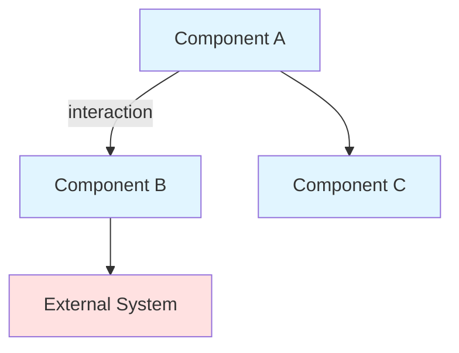
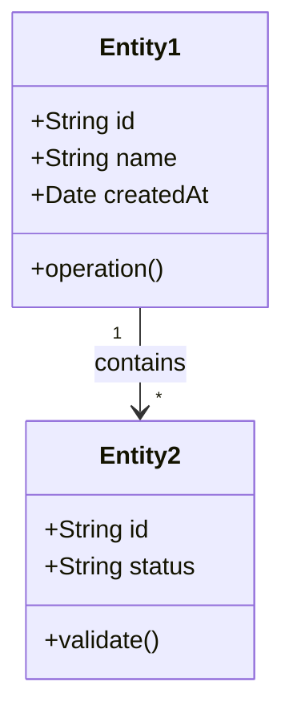
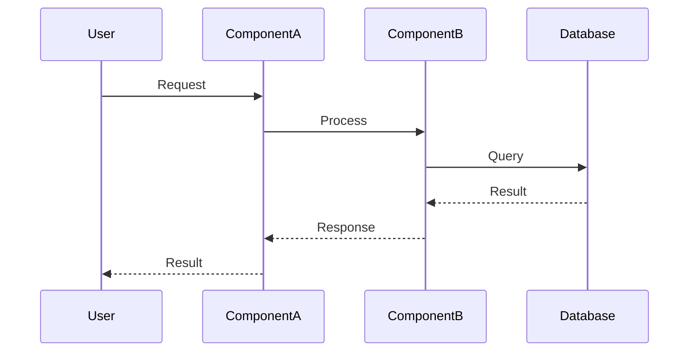

# [Feature/Component Name] Design Document

> **Status:** [Draft | Under Review | Approved | Implemented]
> **Author:** [Your Name]
> **Date:** [YYYY-MM-DD]
> **Last Updated:** [YYYY-MM-DD]

---

## Overview

[Brief 1-2 paragraph summary of what this document describes. What is being built and why?]

---

## Problem Statement

### Current Situation

[Describe the current state. What exists today? What are the pain points?]

### Goals

[What are we trying to achieve? What would success look like?]

**Primary Goals:**
- Goal 1
- Goal 2
- Goal 3

**Non-Goals:**
- What we explicitly will NOT do
- Out of scope items
- Future enhancements to defer

---

## Requirements

### Functional Requirements

**Must Have:**
1. Requirement 1
2. Requirement 2
3. Requirement 3

**Should Have:**
1. Nice-to-have feature 1
2. Nice-to-have feature 2

**Could Have:**
1. Future consideration 1
2. Future consideration 2

### Non-Functional Requirements

**Performance:**
- Response time: [e.g., < 200ms for 95th percentile]
- Throughput: [e.g., handle 1000 requests/second]
- Resource usage: [memory, CPU constraints]

**Scalability:**
- Expected load: [current and projected]
- Growth expectations: [over what timeframe]

**Reliability:**
- Availability target: [e.g., 99.9% uptime]
- Error handling: [strategy for failures]
- Data consistency: [requirements]

**Security:**
- Authentication/authorization requirements
- Data protection needs
- Compliance requirements

**Maintainability:**
- Testability requirements
- Monitoring and observability needs
- Documentation requirements

---

## Proposed Solution

### High-Level Approach

[Describe the overall approach in plain language. What's the core idea?]

### Architecture Overview

[High-level architecture diagram showing major components and their relationships]

### Component Breakdown

#### Component 1: [Name]

**Responsibility:** [Single, clear responsibility]

**Key Operations:**
- Operation 1: [Description]
- Operation 2: [Description]

**Dependencies:**
- Dependency 1
- Dependency 2

**Implementation Notes:**
- Note about design patterns, principles, or approach
- Technology choices
- Key considerations

---

#### Component 2: [Name]

**Responsibility:** [Single, clear responsibility]

**Key Operations:**
- Operation 1: [Description]
- Operation 2: [Description]

**Dependencies:**
- Dependency 1
- Dependency 2

**Implementation Notes:**
- Note about design patterns, principles, or approach
- Technology choices
- Key considerations

---

### Data Model

[If applicable, describe the key data structures, entities, or database schema]

[Describe relationships, constraints, and important notes about the data model]

---

### Key Interactions

[Describe important workflows or interactions between components. Use sequence diagrams sparingly, only for complex flows.]

**Workflow 1: [Name]**

[Step-by-step description]

1. Step 1: [Description]
2. Step 2: [Description]
3. Step 3: [Description]

[Include sequence diagram ONLY if the interaction is complex and hard to describe in words]

---

## Design Patterns and Principles Applied

### Patterns Used

- **[Pattern Name]**: [Where and why it's used]
- **[Pattern Name]**: [Where and why it's used]

### Principles Followed

**SOLID:**
- [Which SOLID principles are particularly relevant and how they're applied]

**Other Principles:**
- **DRY**: [How duplication is avoided]
- **YAGNI**: [What complexity was avoided]
- **KISS**: [How simplicity was maintained]

---

## Alternatives Considered

### Alternative 1: [Name]

**Description:** [How this approach would work]

**Pros:**
- Advantage 1
- Advantage 2

**Cons:**
- Disadvantage 1
- Disadvantage 2

**Why not chosen:** [Reasoning for rejecting this alternative]

---

### Alternative 2: [Name]

**Description:** [How this approach would work]

**Pros:**
- Advantage 1
- Advantage 2

**Cons:**
- Disadvantage 1
- Disadvantage 2

**Why not chosen:** [Reasoning for rejecting this alternative]

---

## Trade-offs

[Explicit discussion of trade-offs made in the proposed solution]

| Aspect | Trade-off | Rationale |
|--------|-----------|-----------|
| Complexity vs. Flexibility | [What was chosen] | [Why this balance makes sense] |
| Performance vs. Maintainability | [What was chosen] | [Why this balance makes sense] |
| [Other trade-off] | [What was chosen] | [Why this balance makes sense] |

---

## Implementation Notes

### Phase 1: [Milestone]

**Scope:**
- Deliverable 1
- Deliverable 2

**Success Criteria:**
- Criterion 1
- Criterion 2

---

### Phase 2: [Milestone]

**Scope:**
- Deliverable 1
- Deliverable 2

**Success Criteria:**
- Criterion 1
- Criterion 2

---

### Testing Strategy

**Unit Tests:**
- [What will be unit tested]
- [Key test scenarios]

**Integration Tests:**
- [What integrations will be tested]
- [Key test scenarios]

**Other Testing:**
- Performance testing approach
- Security testing approach
- Acceptance testing approach

---

## Risks and Mitigation

| Risk | Likelihood | Impact | Mitigation Strategy |
|------|------------|--------|---------------------|
| [Risk 1] | High/Med/Low | High/Med/Low | [How to mitigate or handle] |
| [Risk 2] | High/Med/Low | High/Med/Low | [How to mitigate or handle] |
| [Risk 3] | High/Med/Low | High/Med/Low | [How to mitigate or handle] |

---

## Dependencies

**Technical Dependencies:**
- Library/framework 1: [Why needed]
- Service 1: [Why needed]

**Team Dependencies:**
- Team 1: [What's needed from them]
- Team 2: [What's needed from them]

**Blocking Issues:**
- [Any blockers that must be resolved before implementation]

---

## Open Questions

1. **[Question 1]**
   - Context: [Why this matters]
   - Options: [Possible answers]
   - Decision needed by: [Date/milestone]

2. **[Question 2]**
   - Context: [Why this matters]
   - Options: [Possible answers]
   - Decision needed by: [Date/milestone]

---

## Monitoring and Observability

**Key Metrics:**
- Metric 1: [What it measures, target value]
- Metric 2: [What it measures, target value]

**Logging:**
- [What events should be logged]
- [Log levels and detail]

**Alerts:**
- Alert 1: [Condition, who to notify]
- Alert 2: [Condition, who to notify]

---

## Future Enhancements

[Ideas for future iterations that are out of scope for initial implementation]

1. Enhancement 1: [Description]
2. Enhancement 2: [Description]
3. Enhancement 3: [Description]

---

## References

- [Related documents]
- [External resources]
- [Prior art or similar systems]

---

## Appendix

[Any additional diagrams, code samples, detailed specifications, or supporting materials]
